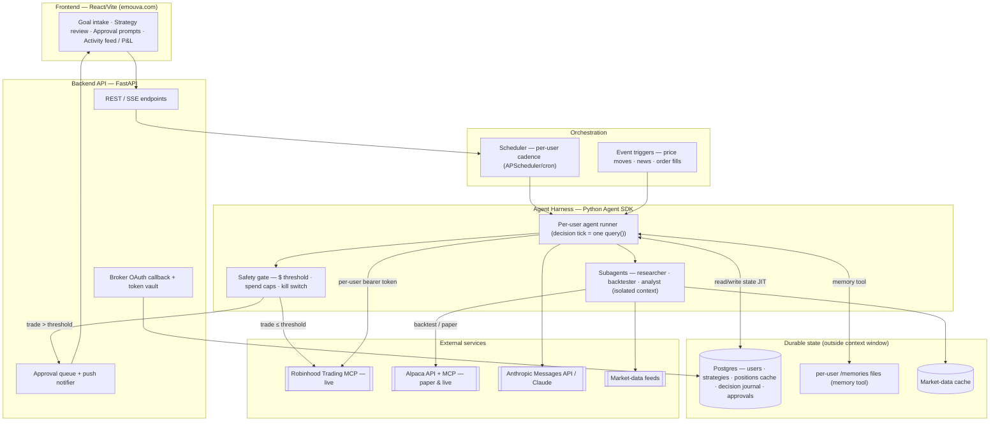
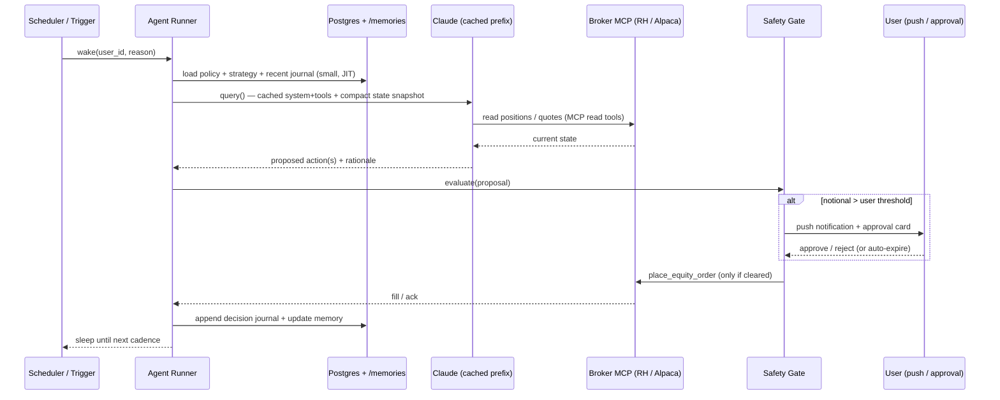
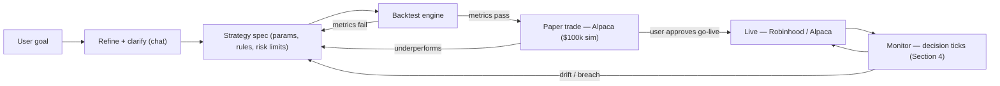

# Emouva — Agentic Trading Platform: Architecture

> **Living document.** Keep this updated as the design evolves — it is the single source of truth for the harness.
> **Last updated:** 2026-06-23 · **Status:** v0.1 (harness design, grounded in Claude Agent SDK research)
> See the changelog at the bottom. Diagrams are Mermaid (render in GitHub/VS Code).

---

## 1. What we're building

Each user gets a personal AI **agent trader**. The user gives a goal → we refine it → develop & **backtest** strategies → optionally **paper-trade** with fake money → trade real money via **Robinhood's agent MCP** (and/or **Alpaca**). The agent runs a **decision loop** (wakes on a schedule or event, reads portfolio/market state, decides whether to act) and routes any trade above a user-set dollar threshold to a **human approval** pop-up.

The two hard parts are (a) **context efficiency** — running many long-lived agents cheaply — and (b) **safety/compliance** — keeping the human in the loop and the agent inside guardrails. This doc is about (a) plus the system shape; compliance is tracked in [`emouva-agentic-trading-pivot` memory].

---

## 2. Guiding principle — context efficiency

**A trading agent must NOT hold one ever-growing conversation.** Token cost and latency scale with context size, and we run one agent per user, ticking indefinitely. The design rule:

> **The context window is scratch space, not storage. Each decision tick cold-starts a small, cache-friendly context; all durable state lives in Postgres + memory files and is pulled in just-in-time.**

Four levers, all native to the Claude platform:

1. **Cold-start minimal ticks** — every wake builds a fresh, tiny context = *stable cached system prompt + user policy + a compact state snapshot + "should we act?"*. Input tokens stay **bounded** instead of growing.
2. **State lives outside the window** — the **memory tool** (`/memories` files) + Postgres hold the decision journal, open theses, and strategy params. The agent retrieves on demand. ([memory tool docs](https://platform.claude.com/docs/en/agents-and-tools/tool-use/memory-tool))
3. **Subagents for bursts** — heavy/noisy work (strategy research, backtest analysis, multi-ticker deep-dives) runs in **isolated subagent context**; only the summary returns to the main loop. ([subagents docs](https://code.claude.com/docs/en/agent-sdk/subagents))
4. **Prompt caching + context editing** — a stable system/tool prefix is cached (1h TTL across slow ticks); long interactive sessions use server-side **compaction** and **tool-result clearing**. ([prompt caching](https://platform.claude.com/docs/en/build-with-claude/prompt-caching), [context editing](https://platform.claude.com/docs/en/build-with-claude/context-editing), [compaction](https://platform.claude.com/docs/en/build-with-claude/compaction))

---

## 3. System architecture

**Why these boundaries:** the **harness** is a separate worker process (Python, same repo/stack as the FastAPI backend), so heavy agent runs never block the web API. The **scheduler** owns *when* agents wake; the **runner** owns *what happens in one tick*; the **safety gate** is a hard code layer (not a prompt), because Robinhood's own approval is soft/prompt-driven (see pivot research).

---

## 4. The decision tick (the core loop)

Each wake is **one cheap `query()`** with a cached prefix. State is loaded just-in-time and written back to the journal/memory before sleeping.

### Per-tick context budget (target)

| Segment | Source | Cache? | ~Tokens |
|---|---|---|---|
| System prompt + trading policy | static per user-tier | **cached (1h TTL)** | stable, free on hit |
| Tool schemas (Robinhood/Alpaca MCP) | MCP, **tool-search on** | cached | withheld until needed |
| User strategy spec + risk limits | Postgres → prompt | cached if unchanged | small |
| Compact state snapshot (positions, cash, watch, last N decisions) | Postgres/memory | not cached (changes) | **small & bounded** |
| "Should we act now?" instruction | static | cached | tiny |

The only segment that grows is the snapshot, and we keep it summarized. **Input tokens per tick stay roughly constant regardless of how long the agent has been running** — that is the whole point.

---

## 5. Strategy lifecycle (goal → live)

**Backtest + paper are fully decoupled from Robinhood** — they run on historical data + Alpaca's paper API, so this whole left half is buildable now regardless of Robinhood's open multi-user questions.

---

## 6. Context-management toolkit — Agent SDK feature → how we use it

| Capability | Identifier / option | How emouva uses it | Doc |
|---|---|---|---|
| **Subagents** | `agents` / `AgentDefinition` (per-agent `model`, `tools`, `effort`, `maxTurns`, `mcpServers`, `background`) | Isolate research/backtest/deep-dive so only summaries hit the main loop. Cheaper models for routine subagents (`model: "sonnet"`/`"haiku"`). | [subagents](https://code.claude.com/docs/en/agent-sdk/subagents) |
| **Memory tool** | tool type `memory_20250818`, client-side `/memories` (view/create/str_replace/insert/delete/rename) | Per-user durable state: decision journal, open theses, strategy notes. "Assume interruption" — survives context resets between ticks. **We implement the storage backend** (Postgres-backed or disk per user). | [memory tool](https://platform.claude.com/docs/en/agents-and-tools/tool-use/memory-tool) |
| **Context editing** | `clear_tool_uses_20250919`, beta `context-management-2025-06-27`; knobs `trigger`, `keep`, `clear_at_least`, `exclude_tools`, `clear_tool_inputs` | For long interactive/burst sessions: drop stale MCP tool results, keep last N. Use `clear_at_least` so we don't break cache for tiny gains. | [context editing](https://platform.claude.com/docs/en/build-with-claude/context-editing) |
| **Compaction** | `compact_20260112`, beta `compact-2026-01-12`; `trigger` (default 150k, min 50k), `pause_after_compaction`, `instructions` | Server-side summarization for goal-refinement chats / long autonomous bursts. Pair with memory so nothing critical is lost in the summary. | [compaction](https://platform.claude.com/docs/en/build-with-claude/compaction) |
| **Prompt caching** | `cache_control:{type:"ephemeral"}`, `ttl:"1h"` for slow ticks; breakpoints on stable `tools`→`system` prefix | Cache the per-tier system+policy+tool prefix; ticks pay ~0.1x on the cached prefix. **Keep tool definitions stable** (any change invalidates all caches). Pre-warm on user activation. | [prompt caching](https://platform.claude.com/docs/en/build-with-claude/prompt-caching) |
| **MCP tool search** | on by default in SDK | Robinhood + Alpaca expose large tool sets; tool-search withholds schemas until needed, saving context. | [MCP in SDK](https://code.claude.com/docs/en/agent-sdk/mcp) |
| **Per-user MCP auth** | `mcpServers:{ rh:{ type:"http", url, headers:{Authorization:"Bearer <token>"}}}`, `allowedTools:["mcp__rh__*"]` | Inject each user's broker bearer token per `query()` call → one harness serves many users. **OAuth/refresh is our job** (SDK doesn't run OAuth). Prefer `allowedTools` over permission modes. | [MCP in SDK](https://code.claude.com/docs/en/agent-sdk/mcp) |
| **Sessions / resume** | new session per `query()`; `resume: session_id` | Default = fresh tick (cheapest). Resume only for multi-turn interactive flows (goal refinement). Subagent transcripts persist separately; resumable via `agentId`. | [subagents](https://code.claude.com/docs/en/agent-sdk/subagents) |

**Model tiering:** Opus 4.8 for hard/large-notional decisions & strategy design; Sonnet 4.6 for routine ticks; Haiku 4.5 for cheap "anything changed?" pre-checks. Subagent `model` override makes this per-task.

---

## 7. Safety / approval layer (hard-coded, not prompted)

- **Threshold gate:** any proposed order with notional `> user.approval_threshold` is enqueued, push-notified, and **blocks** until approve/reject/expire. Below threshold → auto-execute.
- **Spend caps:** per-tick, daily, and total caps enforced in code before any `place_*_order` MCP call (Robinhood has no native hard cap beyond the funded agentic-account balance).
- **Kill switch:** one flag disconnects the user's agent and halts all ticks.
- **Fenced funds:** rely on Robinhood's dedicated *Agentic account* isolation as defense-in-depth (agent can only spend deposited funds).
- **Audit:** every proposal + decision + fill written to the journal (immutable), surfaced in the activity feed.

---

## 8. Multi-tenant & state placement

| State | Lives in | Why |
|---|---|---|
| Broker OAuth tokens (per user) | Postgres **token vault** (encrypted), refreshed by API | One harness, many users; tokens injected per `query()` |
| Strategy specs, risk limits, thresholds | Postgres | Queryable, versioned |
| Decision journal, theses, "what I did & why" | Postgres + `/memories` (memory tool) | JIT recall without bloating context |
| Positions/quotes snapshot | Market-data cache + broker MCP reads | Fresh, cheap, not persisted long |
| In-flight conversation | Context window (ephemeral) | Discarded after the tick |

One **runner per user** (process/coroutine), pooled by the harness; isolation is enforced by us (the platform), **not** by Claude — per-user token isolation and `/memories` namespacing are our responsibility. ([Note: an earlier verified finding refuted the assumption that Claude auto-isolates per-user MCP tokens.])

---

## 9. Tech decisions & open questions

**Decided**
- **Harness language = Python Agent SDK**, colocated with the FastAPI backend (one stack; no cross-language ops). Tradeoff: the `Workflow` tool for large fan-outs is TS-only today — we don't need it (our orchestration is a scheduler, not in-conversation fan-out).
- **Cold-start-per-tick + memory tool**, not one long resumed session — for bounded per-tick cost.
- **Backtest/paper on Alpaca**, decoupled from Robinhood, built first.
- **Safety/threshold gate in code**, never relying on Robinhood's prompt-driven approval.

**Open (carried from pivot research / to validate)**
- Does Robinhood permit a **third-party SaaS to broker many users'** MCP connections, and what are its OAuth **scopes / token lifetime / refresh** mechanics? (Biggest unknown.)
- Whether the hot tick should drop from the Agent SDK to **raw Messages API** for maximum token control (optimize later, only if profiling demands).
- Backtesting engine choice (backtrader vs vectorbt vs LEAN vs Nautilus) — pending the focused follow-up research.
- RIA/compliance posture (propose-and-approve vs discretionary) — needs securities counsel.

---

## 10. Code map (implemented — vertical slice)

`backend/app/harness/` is a runnable slice of §4. Run it offline:
`cd backend && PYTHONPATH=$PWD .venv/bin/python -m app.harness.tick --dry-run --ticks 3`

| Module | Layer in the diagrams |
|---|---|
| `state.py` | Typed contracts: `Policy`, `StrategySpec`, `PortfolioSnapshot`, `TradeProposal`, `GateDecision`, `Decision` |
| `brain.py` | Decision-tick brain — **cached stable prefix + small dynamic tail** (§2/§4); Messages API + forced `submit_decision` tool; offline `StubBrain` |
| `memory_store.py` | Memory-tool backend (§6) — per-user `/memories`, path-traversal safe |
| `journal.py` | Decision journal (§8) — append-only JSONL → Postgres later |
| `safety.py` | `SafetyGate` (§7) — caps, concentration, kill switch, approval threshold (code, not prompt) |
| `brokers/` | `Broker` protocol + `MockBroker` + optional `AlpacaPaperBroker` (§3/§5) |
| `runner.py` | `AgentRunner.tick()` — the loop in §4 |
| `tick.py` | CLI + demo user fixture |

**Verified offline:** cached prefix flat at ~482 tok/tick; dynamic tail bounded by the 5-decision recap window; all three gate paths (auto-execute / approval / kill-switch) exercised; journal + memory persisted. **Not yet wired:** broker MCP adapter, per-user OAuth, scheduler/cadence, Agent-SDK subagents. See `backend/app/harness/README.md`.

## 11. Changelog

- **v0.2 (2026-06-23)** — Runnable vertical slice under `backend/app/harness/`: typed state, memory-tool backend, broker abstraction (mock + Alpaca-paper), cached-prefix brain + offline stub, safety gate, journal, runner, CLI. Verified end-to-end offline (3 ticks + approval + kill-switch).
- **v0.1 (2026-06-23)** — Initial harness architecture. Grounded in Claude Agent SDK docs (subagents, memory tool, context editing, compaction, prompt caching, MCP auth). System + decision-tick + lifecycle diagrams. Context-efficiency principle established.
